# Ecosystem Current State

## Repository Graph
```mermaid
graph TD
    Workspace[workspace (Distributed Monorepo)]
    Vireon[vireon (Core SDK & Runtime)]
    VireonLab[vireon-lab (UI & Tools)]
    NeuroDSL[neurodsl (Rust Simulation Engine)]
    GitHub[.github (CI/CD Ecosystem)]

    Workspace --> Vireon
    Workspace --> VireonLab
    Workspace --> NeuroDSL
    Workspace --> GitHub
    VireonLab --> Vireon
    Vireon --> NeuroDSL
```

## Dependency Graph
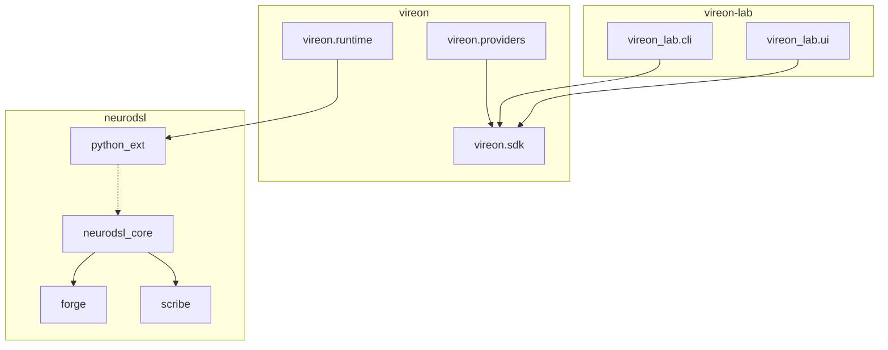

## Package Graph
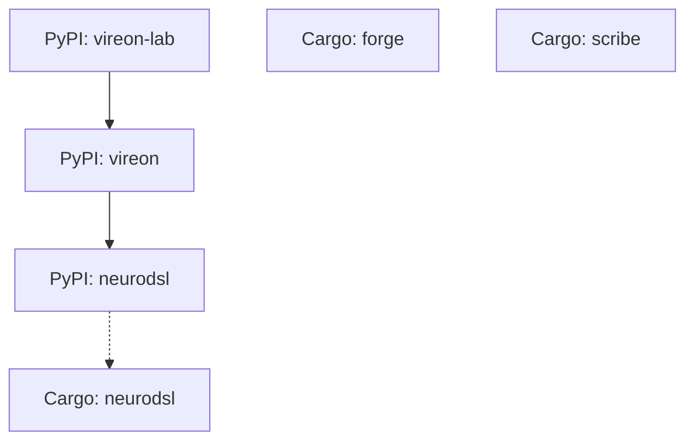

## Import Graph (Python)
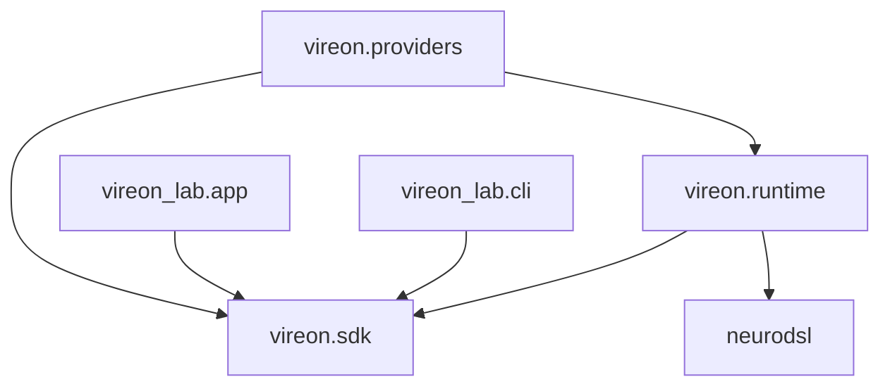

## Documentation Graph
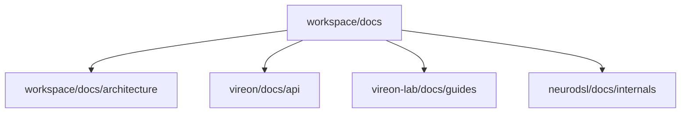

## Ownership Graph
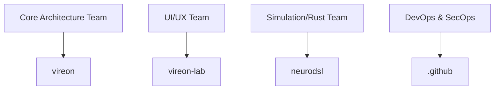

## Architecture Graph
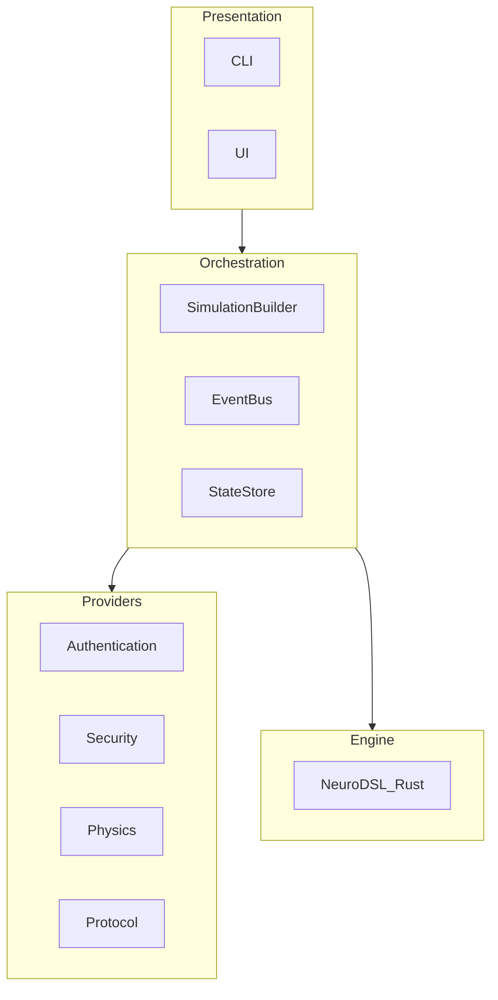

## CI Graph
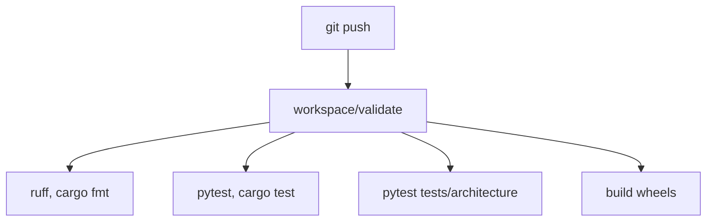

## Docker Graph
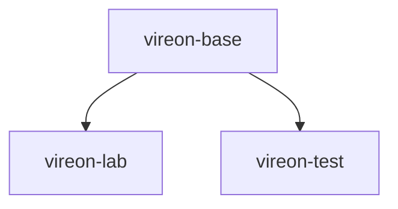

## Release Graph
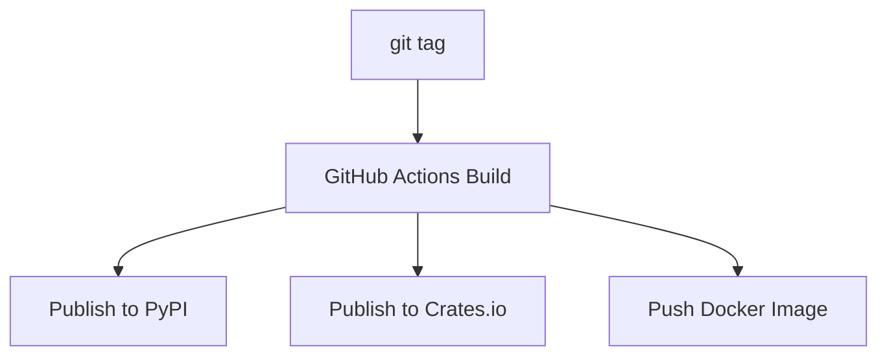

## Testing Graph
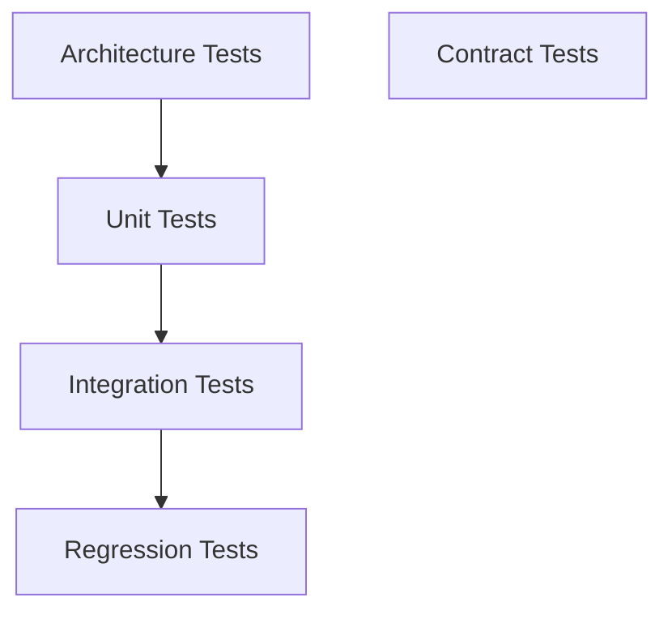

## Plugin Graph
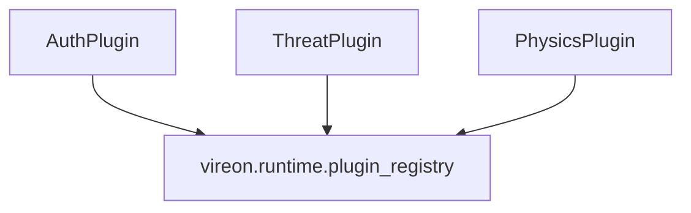

## Provider Graph
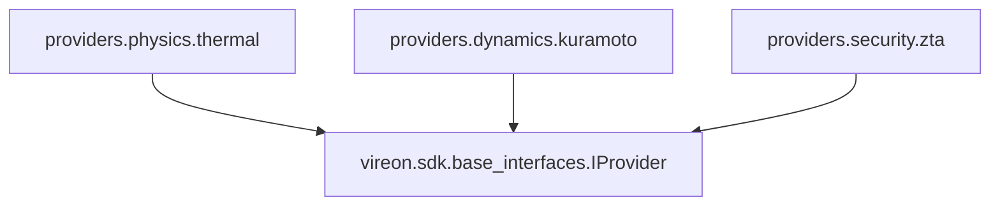

## SDK Graph
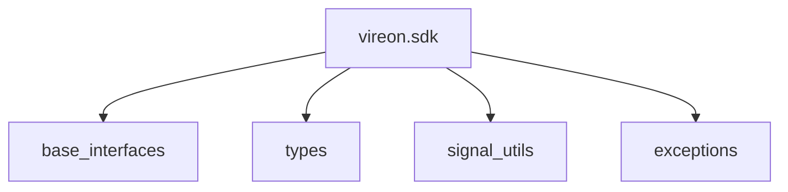

## Workspace Graph
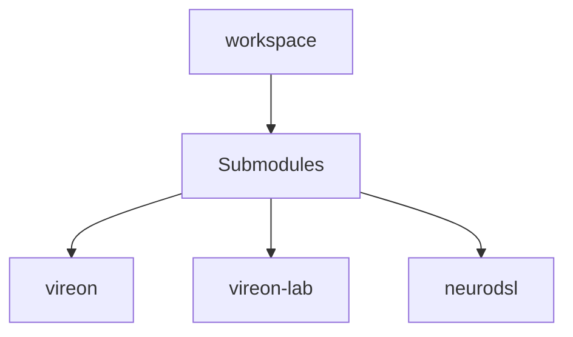

## Knowledge Graph
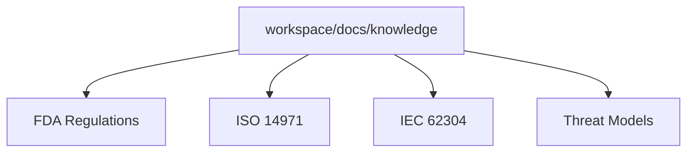
