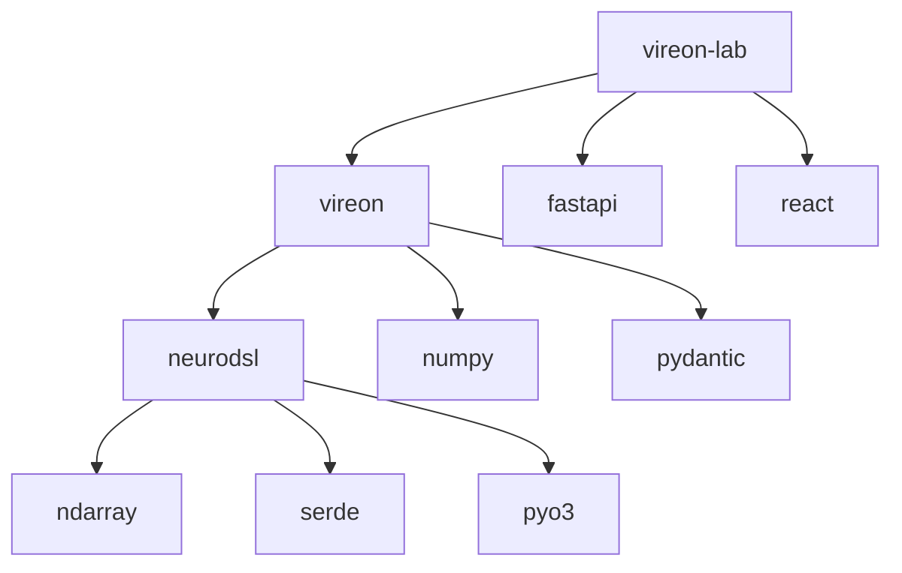
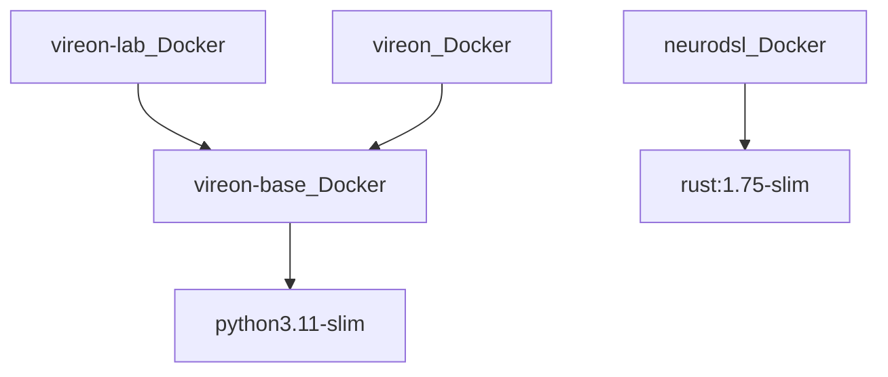

# VIREON Ecosystem Dependency Graph

This document isolates the detailed dependency mapping across all repositories.

## 1. Top-Level Package Dependencies

## 2. Infrastructure Dependencies

## 3. Vulnerability Surface
- `numpy`, `pydantic`, `fastapi`, and `pyo3` represent the most critical software supply chain vectors. Strict hash pinning is required.
