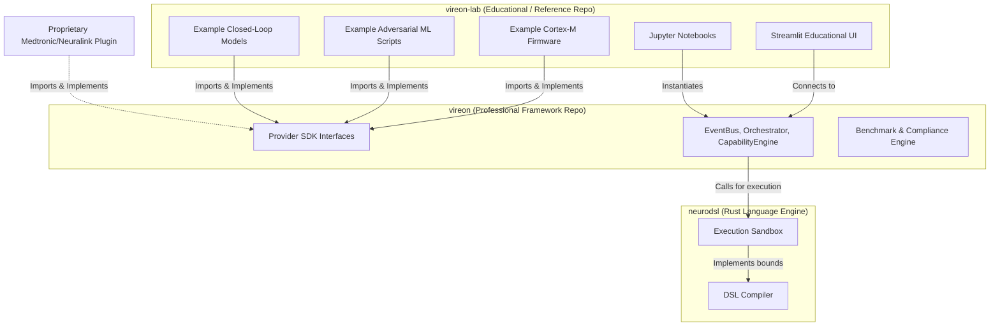
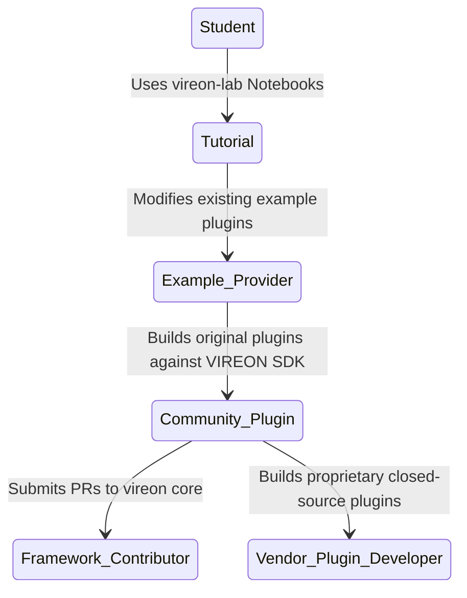

# The VIREON Ecosystem

## 1. Architectural Philosophy

VIREON is a professional, vendor-neutral validation runtime for neurotechnology systems. 

To satisfy the divergent needs of our user base without compromising the architectural integrity of the framework, the VIREON project is strictly divided into distinct repositories:

1. **`vireon`**: The professional framework and validation infrastructure.
2. **`vireon-lab`**: The educational platform and official reference implementation.
3. **`neurodsl`**: The low-level Rust domain-specific language engine.

### Why Separate Repositories?
A single repository mixing orchestration logic with educational "toy" implementations creates catastrophic technical debt. 
- **Professional users** (Neuralink, Synchron, FDA researchers) require a minimal, hardened, high-performance validation engine without the bloat of visualization notebooks or reference firmware.
- **Educational users** (Students, Universities) require rich UI dashboards, heavily commented example code, and pre-built attack scenarios.

By separating the two, we achieve **Maximum Separation of Concerns** and **Stable Long-Term Maintenance**.

---

## 2. Repository Boundaries & Ownership

The fundamental rule is: **If it defines how the system runs, it belongs in `vireon`. If it is an *example* of something running on the system, it belongs in `vireon-lab`.**

| Component | `vireon` | `vireon-lab` | Reason |
| :--- | :---: | :---: | :--- |
| **Orchestrator & EventBus** | ✅ | ❌ | Core runtime engine. |
| **StateStore & PluginRegistry** | ✅ | ❌ | Core runtime mechanics. |
| **CapabilityEngine & ZTA** | ✅ | ❌ | Core security model. |
| **Provider SDK & Interfaces** | ✅ | ❌ | Public API contract. |
| **Validation & Benchmark Engine** | ✅ | ❌ | Professional testing infrastructure. |
| **Streamlit Dashboard** | ❌ | ✅ | Educational UI. |
| **Tutorials & Notebooks** | ❌ | ✅ | Learning content. |
| **Example Firmware (`plugins/firmware`)** | ❌ | ✅ | Teaching/Reference provider. |
| **Example Clinical Models (`plugins/clinical`)**| ❌ | ✅ | Reference physical models. |
| **Example Attacks (`attacks/`)** | ❌ | ✅ | Pre-built threat scenarios for CTFs/Labs. |

---

## 3. Dependency Direction

**The Golden Rule**: `vireon-lab` depends on `vireon`. `vireon` must **never** depend on `vireon-lab`.



The educational platform consumes *only* the public SDK interfaces (`vireon.sdk`). It must not hook into internal runtime memory structures or circumvent the EventBus.

---

## 4. Final Repository Structures

### `vireon`
```text
vireon/
├── vireon/
│   ├── core/           # Orchestrator, EventBus, StateStore, CapabilityEngine
│   ├── sdk/            # IProvider, SubprocessProvider, IPC wrappers
│   ├── security/       # ZTA, Guardrails, Authentication
│   ├── validation/     # Fuzzer, Compliance, SBOM, ThreatIntel
│   └── services/       # ReplayEngine
├── docs/               # Framework Architecture, API Specs
├── tests/              # Core Unit Tests, Benchmark Tests
└── pyproject.toml
```

### `vireon-lab`
```text
vireon-lab/
├── vireon_lab/
│   ├── dashboard/      # Streamlit apps
│   ├── tutorials/      # Markdown guides
│   ├── notebooks/      # Jupyter notebooks for data analysis
│   ├── scenarios/      # Pre-packaged CTF and attack scenarios
│   └── examples/       # Firmware, decoders, physics
├── datasets/           # Sample neural telemetry captures
└── pyproject.toml      # Requires: vireon >= 1.0.0
```

### `neurodsl`
```text
neurodsl/
├── src/                # Core Rust implementation
├── Cargo.toml          # Rust package manager config
└── README.md           # Introduction to the DSL
```

---

## 5. Versioning Strategy

`vireon` and `vireon-lab` use a synchronized but decoupled versioning matrix.

### Versioning Matrix
- `vireon` uses strict **Semantic Versioning** (`MAJOR.MINOR.PATCH`).
- `vireon-lab` tracks the **MAJOR** and **MINOR** versions of the framework it is designed for. 

**Compatibility Guarantee**:
If an academic lab writes a custom tutorial against `vireon-lab 1.0.0`, they are guaranteed that the underlying `vireon.sdk` will not break their code unless `vireon` increments to `2.0.0`.

---

## 6. Contributor Workflows

The split ecosystem naturally guides contributors through an escalating path of expertise.



- **Bug in a tutorial?** PR goes to `vireon-lab`.
- **Bug in the EventBus?** PR goes to `vireon`.
- **New Plugin idea?** If it's a general teaching tool, PR to `vireon-lab/examples`. If it's a proprietary tool, it stays in the vendor's private repo using the VIREON SDK.

---

## 7. Documentation Ownership

| Documentation Type | Belongs In | Rationale |
| :--- | :--- | :--- |
| Core Architecture | `vireon` | Dictates how the framework operates. |
| Interface Contracts | `vireon` | Defines the API for developers. |
| Security Model | `vireon` | Defines enforcement mechanisms. |
| Walkthroughs & Labs | `vireon-lab` | Educational narrative content. |
| Plugin Reference Implementations | `vireon-lab` | Docs specific to the example plugins. |
