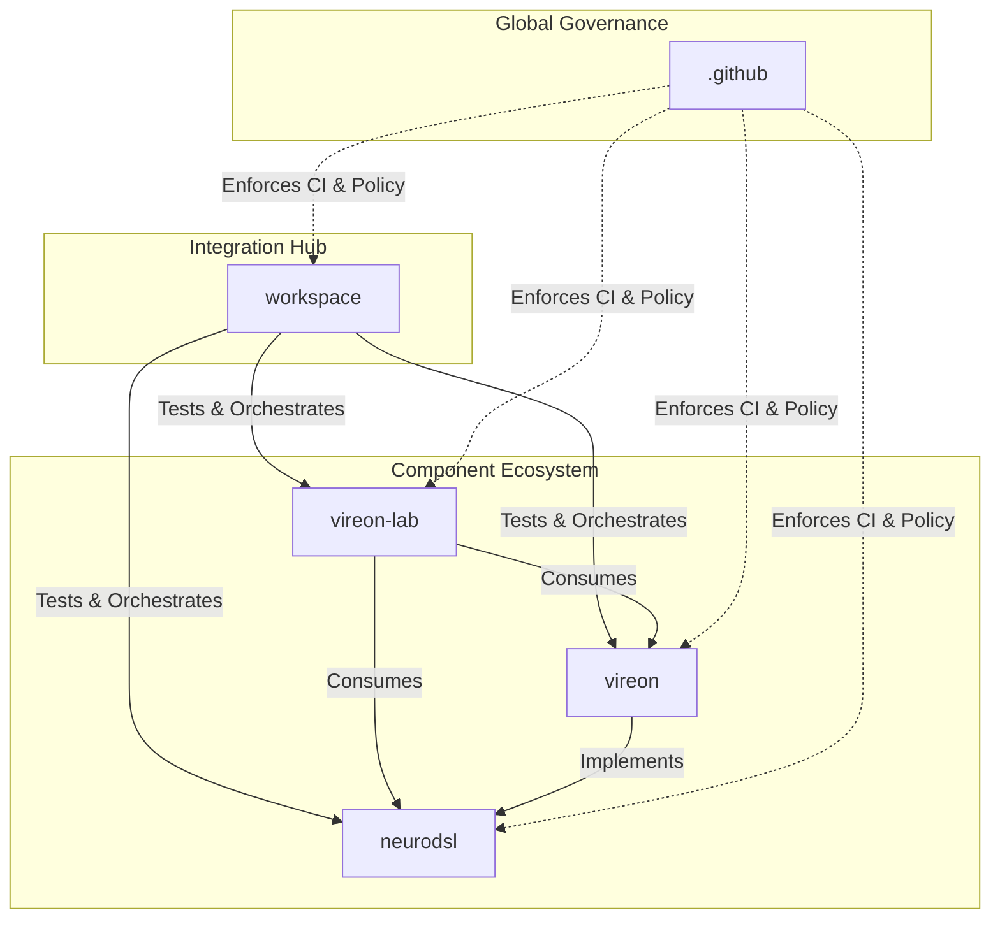

# The Final Ecosystem Architecture

## Ecosystem Overview
The VIREON ecosystem has been redesigned into a professional, multi-repository infrastructure project. It operates on the principle that **every responsibility has exactly one owner**. Duplication of documentation, DevOps, CI, and governance has been strictly eliminated.

## 1. Repositories
The ecosystem is split into 5 distinct repositories:
- **`vireon`**: The core framework, runtime, SDK, and canonical documentation.
- **`neurodsl`**: The low-level Rust domain-specific language engine.
- **`vireon-lab`**: The educational platform, examples, user tutorials, and knowledge base.
- **`workspace`**: The integration hub (orchestration, E2E testing, version locking).
- **`.github`**: The global governance hub (community standards, reusable CI, security policies).

## 2. Documentation & Knowledge
- **Canonical Docs**: Hosted solely in `vireon/docs/`.
- **Architecture Audits**: Hosted in `vireon/docs/architecture/` (e.g. `ECOSYSTEM_AUDIT.md`, `OWNERSHIP_MATRIX.md`).
- **ADRs & RFCs**: Hosted in `vireon/docs/adr/` and `vireon/docs/rfcs/`.
- **Knowledge Base**: Educational content (papers, neuroscience) has been aggressively deduplicated and moved entirely to `vireon-lab/knowledge/`.
- **READMEs**: All repo READMEs are strictly minimal.

## 3. CI / CD
- **Reusable Workflows**: Stored in the `.github` repository.
- **Integration CI**: Stored in the `workspace` repository.

## 4. Docker
- **Base Image**: `vireon/Dockerfile` builds the canonical base image.
- **Orchestration**: A single `workspace/docker-compose.yml` spins up the entire integrated ecosystem.

## 5. Workspace & Integration
The `workspace` is the only repository aware of the full ecosystem graph. It conducts:
- **Contract Testing**: Ensures `neurodsl` and `vireon` APIs remain compatible.
- **Compatibility Matrix**: Validates the supported version combinations.

## 6. Dependency Graph

## Summary
By separating governance (`.github`), orchestration (`workspace`), core logic (`vireon`, `neurodsl`), and educational material (`vireon-lab`), the VIREON project is now scalable, deterministic, and highly maintainable for hundreds of future contributors.
