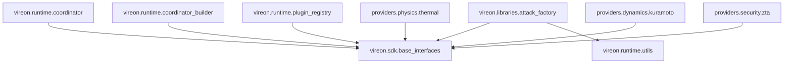

# VIREON Ecosystem Import Graph

This document isolates the internal Python/Rust import flows, validating architectural boundaries.

## 1. Python Namespace Boundaries

## 2. Forbidden Import Enforcement
The import graph guarantees that no `providers.*` or `vireon.libraries.*` namespace is ever imported statically into `vireon.runtime.*`. Registration occurs strictly at runtime via dynamic instantiation.
