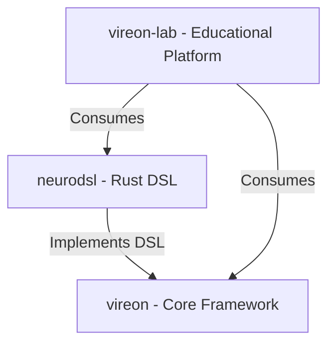

# Integration Architecture

## Ecosystem Integration Overview

The VIREON ecosystem is distributed across multiple repositories to maintain separation of concerns. However, true value is delivered when these components interoperate. This document defines the integration architecture for the entire ecosystem.

## Repository Relationships & Dependency Graph

- **`vireon`:** The foundational framework. Depends on nothing in the ecosystem.
- **`neurodsl`:** Defines the low-level domain specific language. Used by `vireon` (optional dependency / plugin architecture) or consumed directly.
- **`vireon-lab`:** Educational and lab environment. Depends on both `vireon` and `neurodsl` to run practical tutorials.

## Workspace Purpose

The `workspace` repository does not produce any deliverable software artifact (like a binary or library). Instead, it serves as the **Integration Workspace**.

It is used by CI and developers to:
1. Clone all ecosystem repositories side-by-side.
2. Spin up the entire ecosystem via `docker-compose.yml`.
3. Run cross-repository end-to-end testing.

## Compatibility Matrix

Versions are strictly controlled via Semantic Versioning. The `workspace` maintains the ecosystem compatibility matrix, defining which versions are known to work together.

| VIREON Version | NeuroDSL Version | Lab Version | Status |
|----------------|------------------|-------------|--------|
| `v1.x`         | `v0.8.x`         | `v1.x`      | Supported (Stable) |
| `v2.x`         | `v1.x`           | `v2.x`      | Supported (Stable) |
| `main`         | `main`           | `main`      | Unstable (Development) |

## Cross-Repository Testing & Release Synchronization

### Integration Pipeline

1. **Local CI (Component Level):** Each repository runs its own unit tests.
2. **Contract Validation:** The `workspace` verifies API contracts between `vireon` and `neurodsl`.
3. **E2E Testing:** The `workspace` pulls the latest successful artifacts of all repos and runs end-to-end integration tests.

### Release Synchronization

Releases are NOT strictly synchronized. Components may release independently using semantic versioning. However, major version bumps (e.g., `v1` to `v2`) must be coordinated across the ecosystem to ensure compatibility. 

### SDK and Provider Compatibility

- **Plugin Validation:** Plugins (developed inside or outside the ecosystem) are validated against the `vireon` SDK version defined in the contract tests.
- **Provider Compatibility:** Providers must pass the standardized conformance suite maintained in the `vireon` core.

## Failure Recovery

If an ecosystem-wide failure occurs (e.g., a change in `vireon` breaks `vireon-lab`):
1. The `workspace` cross-repo CI pipeline will turn RED.
2. The failing PR in the component repository will be blocked from merging.
3. The ecosystem version matrix will remain on the last known good configuration until the breakage is resolved.
